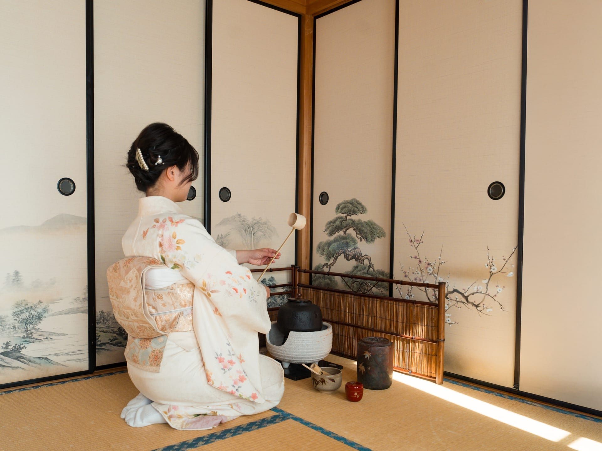

# 圖片優化指南

本專案已配置完整的圖片優化方案，確保高畫質輸出和最佳效能。

## 📋 功能概述

1. **圖片格式轉換**：支援 WebP 和 AVIF 格式
2. **高畫質保證**：品質設定為 92（避免過度壓縮）
3. **響應式圖片**：自動生成多種尺寸版本
4. **部署優化**：配置 Vercel/Netlify 部署設定

## 🚀 快速開始

### 1. 安裝依賴

```bash
npm install
```

### 2. 優化現有圖片

```bash
# 優化 JPG/PNG 圖片（品質 92）
npm run optimize-images

# 轉換為 WebP/AVIF 格式
npm run convert-to-webp

# 生成響應式圖片版本
npm run generate-responsive
```

### 3. 構建專案

```bash
npm run build
```

## 📝 腳本說明

### `optimize-images.js`
- 優化現有的 JPG/PNG 圖片
- 品質設定：92（高畫質）
- 生成 WebP 和 AVIF 版本

### `convert-to-webp.js`
- 將所有 JPG/PNG 轉換為 WebP 和 AVIF
- 使用 Sharp 庫進行轉換
- 保持原始畫質（品質 92）

### `generate-responsive.js`
- 生成響應式圖片版本：
  - `_small`: 400px（手機）
  - `_medium`: 800px（平板）
  - `_large`: 1200px（桌面）
  - `_xlarge`: 1920px（大螢幕/Retina）

### `image-utils.js`
- 提供 JavaScript 工具函數
- 可在 `app.js` 中使用生成響應式圖片標籤

## 🖼️ 在代碼中使用響應式圖片

### 方法 1：使用工具函數（推薦）

```javascript
// 生成完整的響應式圖片（包含 picture 標籤）
const imageHTML = generateResponsiveImage('img/茶室體驗封面.jpg', '茶室體驗', {
    sizes: '(max-width: 640px) 100vw, 100vw',
    className: 'hero-image',
    style: 'width: 100%; height: 100vh; object-fit: cover;',
    loading: 'lazy'
});

// 生成簡單的響應式圖片（僅 srcset）
const simpleImageHTML = generateSimpleResponsiveImg('img/茶室體驗1.jpg', '茶室體驗1', {
    sizes: '(max-width: 640px) 100vw, (max-width: 1024px) 50vw, 33vw',
    className: 'gallery-image',
    loading: 'lazy'
});
```

### 方法 2：手動編寫 HTML

```html
<picture>
    <source type="image/avif" srcset="img/茶室體驗封面_small.avif 400w, img/茶室體驗封面_medium.avif 800w, img/茶室體驗封面_large.avif 1200w" sizes="100vw">
    <source type="image/webp" srcset="img/茶室體驗封面_small.webp 400w, img/茶室體驗封面_medium.webp 800w, img/茶室體驗封面_large.webp 1200w" sizes="100vw">
    
</picture>
```

## ⚙️ 品質設定

所有圖片處理腳本都使用 **品質 92**，確保：
- ✅ 高畫質輸出
- ✅ 細節保留
- ✅ 檔案大小合理

如需調整，請修改各腳本中的 `QUALITY` 常數（建議不低於 90）。

## 📦 部署配置

### Vercel
- 已配置 `vercel.json`
- 自動快取圖片資源（1年）
- 無需額外設定

### Netlify
- 已配置 `netlify.toml`
- 自動快取圖片資源（1年）
- 無需額外設定

## 🔍 關鍵攝影作品處理

對於關鍵攝影作品（如封面、主要展示圖片），建議：
1. 直接引用原始高解析度圖片
2. 使用響應式圖片確保不同設備載入適當尺寸
3. 跳過自動縮圖流程，保持原始畫質

## 📱 響應式圖片尺寸建議

- **手機** (< 640px): 400px 寬度
- **平板** (640px - 1024px): 800px 寬度
- **桌面** (1024px - 1920px): 1200px 寬度
- **大螢幕/Retina** (> 1920px): 1920px 寬度

## ⚠️ 注意事項

1. **首次運行**：轉換大量圖片可能需要一些時間
2. **檔案大小**：WebP/AVIF 版本會自動生成，原始檔案保留
3. **瀏覽器支援**：現代瀏覽器會自動選擇最佳格式
4. **回退機制**：不支援的瀏覽器會自動回退到原始格式

## 🛠️ 故障排除

### 圖片轉換失敗
- 確保已安裝所有依賴：`npm install`
- 檢查圖片路徑是否正確
- 確認有足夠的磁碟空間

### AVIF 轉換失敗
- AVIF 需要較新的 Sharp 版本
- 如果失敗，會自動跳過並繼續處理其他格式

### 響應式圖片不顯示
- 檢查是否已運行 `generate-responsive` 腳本
- 確認生成的圖片檔案存在
- 檢查瀏覽器控制台是否有錯誤
